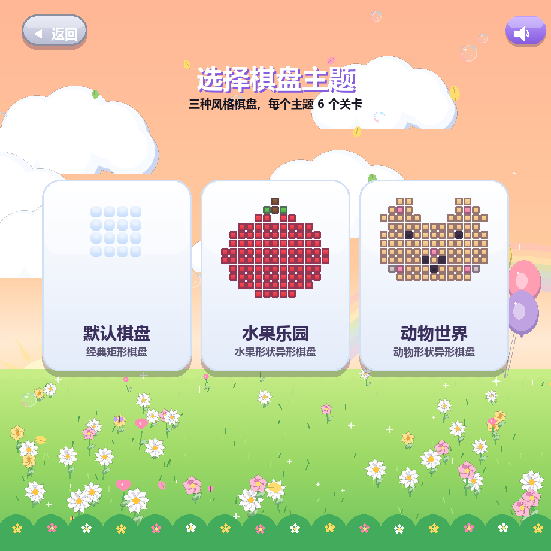
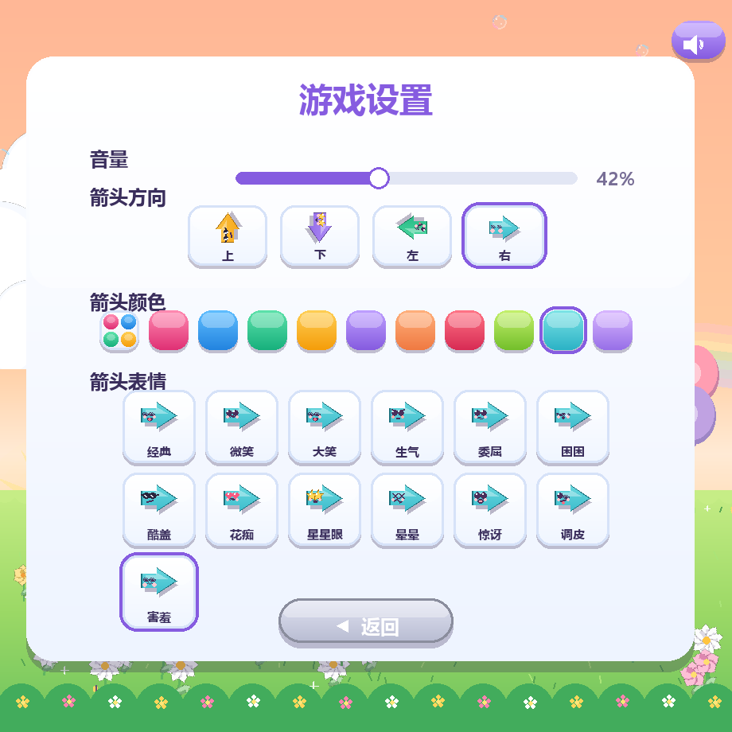
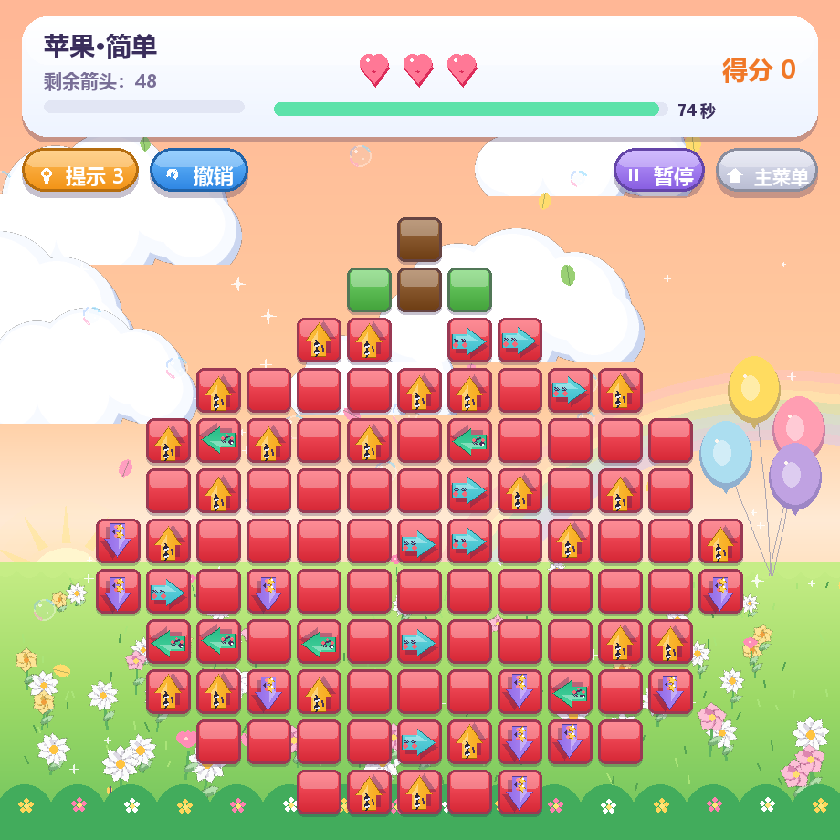
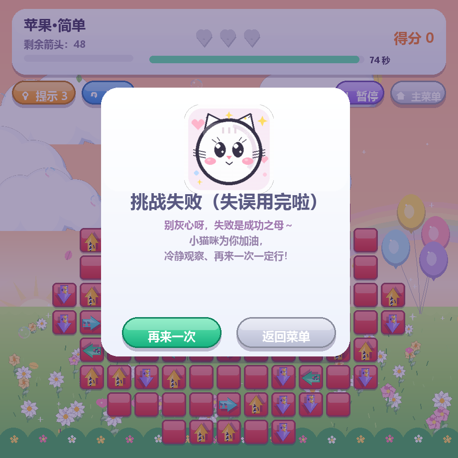
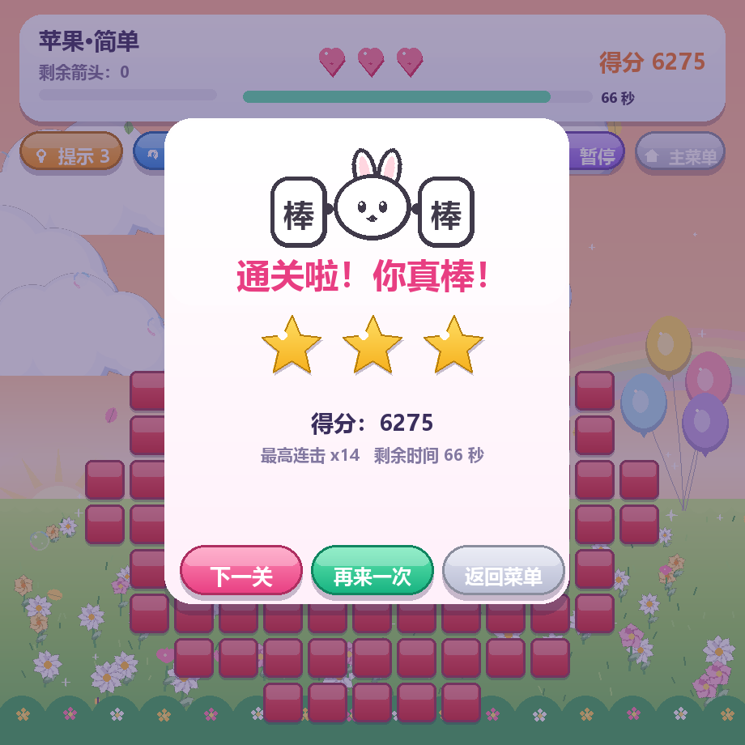

# 🏹 重生之我是箭神

> 糖果色箭头消除解谜 · 点一点，让箭飞出棋盘！

一个糖果色、立体可爱画风的**点击式箭头解谜小游戏**，使用 Python + Pygame 实现。
全部图形与音效均由程序实时绘制 / 合成，**不依赖任何外部素材**，克隆即可运行。

---

## 一、游戏简介

棋盘上散布着朝上、下、左、右四个方向的箭头。点击箭头后，它会沿自身方向射出——前方一路畅通就能飞出棋盘并消除，被其他箭头挡住则消除失败、消耗一次爱心。**清空全部箭头即通关**，爱心用完或倒计时归零则失败。

游戏内置 **三大主题、共 24 个关卡**：

| 主题 | 关卡数 | 棋盘风格 | 解锁方式 |
|------|--------|----------|----------|
| 🏠 默认棋盘 | 12 关 | 经典矩形方阵（4×4 → 7×7，难度递增） | 顺序解锁 |
| 🍎 水果乐园 | 6 关 | 像素画异形棋盘（苹果 / 草莓 / 西瓜 / 葡萄 / 樱桃 / 菠萝） | 全部解锁，自由选择 |
| 🐰 动物世界 | 6 关 | 像素画异形棋盘（小猫 / 兔子 / 小熊 / 企鹅 / 小鱼 / 蝴蝶） | 全部解锁，自由选择 |

每关还可选择 **简单 / 中等 / 困难** 三档难度（箭头密度约 50% / 70% / 88%），通关后按失误情况评定 1~3 星。另有 **随机挑战** 与 **限时挑战** 模式，每次棋盘都由算法逆向构造，**数学上保证 100% 可解**。

---

## 二、开发环境

- **操作系统**：Windows 10 / 11（跨平台，macOS、Linux 同样可运行）
- **编程语言**：Python 3.10 及以上（开发环境 Python 3.11.4）
- **游戏框架**：Pygame 2.5 及以上（开发环境 Pygame 2.6.1）
- **其他依赖**：NumPy（实时合成音效与背景音乐）
- **开发工具**：VS Code
- **窗口规格**：920 × 920，FPS 120

---

## 三、安装和运行方法

### 1. 获取源码

```bash
git clone https://github.com/cheng0673/arrow-game-cz.git
cd arrow-game-cz
```

### 2. 安装依赖

```bash
pip install -r requirements.txt
```

网络较慢时可使用清华镜像源：

```bash
pip install -r requirements.txt -i https://pypi.tuna.tsinghua.edu.cn/simple
```

### 3. 启动游戏

```bash
python main.py
```

Windows 用户也可以直接**双击 `运行游戏.bat`**，脚本会自动完成依赖检查 / 安装并启动游戏。

### 4. 运行单元测试（可选）

```bash
python -m unittest test_model
```

共 21 个测试用例，覆盖路径检测、消除、碰撞、计分、撤销、提示与全部关卡可解性。

---

## 四、游戏操作说明

| 操作 | 方式 |
|------|------|
| 点击箭头 / 按钮 | 鼠标左键 |
| 选择主题 / 关卡 | 鼠标点击对应卡片 |
| 暂停 / 继续 | `ESC` 键或界面上的「暂停」按钮 |
| 提示（每关 3 次） | 点击「提示」按钮，自动高亮一支可安全消除的箭头 |
| 撤销 | 点击「撤销」按钮，恢复上一支箭头并返还失误次数 |
| 静音 / 调节音量 | 界面右上角喇叭按钮，或「游戏设置」中拖动音量滑条 |
| 返回主菜单 | 游戏内「主菜单」按钮 |

在「游戏设置」中还可以自定义**箭头方向配色**（10 种糖果色）和**箭头表情**（13 种可爱表情：微笑、生气、星星眼、花痴……）。

---

## 五、游戏截图

### 🎯 选择棋盘主题

三张白底卡片清爽展示三大主题，点击即可进入。



### ⚙️ 游戏设置

音量滑条、箭头方向配色、13 种箭头表情自由搭配。



### 🍎 水果关卡 · 苹果

圆滚滚的红色果身、棕色果柄、绿色叶子，箭头在果身上等待消除。



### 😿 挑战失败

爱心用完时，小猫咪竖起大拇指为你加油：「冷静观察、再来一次一定行！」



### 🐰 通关成功

举着「棒·棒」牌的小兔子、逐颗弹出的星星与得分结算。



---

## 六、项目结构

```
arrow-game-cz/
├── main.py           # 主程序：界面、动画、粒子特效、场景切换、存档（Pygame 渲染层）
├── model.py          # 核心逻辑：方向 / 箭头 / 棋盘、路径检测、计分、撤销（纯逻辑，可单测）
├── levels.py         # 关卡系统：像素画图案、逆向构造、DFS 求解器、关卡磁盘缓存
├── scenery.py        # 场景背景：天空、昼夜循环、花草、云朵、彩虹
├── sounds.py         # 音效系统：NumPy 实时合成音效与背景音乐
├── test_model.py     # 单元测试：21 个用例覆盖核心逻辑与关卡可解性
├── requirements.txt  # 依赖清单
├── 运行游戏.bat       # Windows 一键启动脚本
└── screenshots/      # README 游戏截图
```

---

## 七、致谢

本项目基于「一箭又一箭」玩法完成，开发过程中借助 AIGC 工具（Trae AI）辅助代码生成、关卡设计与问题排查，在此表示感谢。项目仅供学习交流使用。
